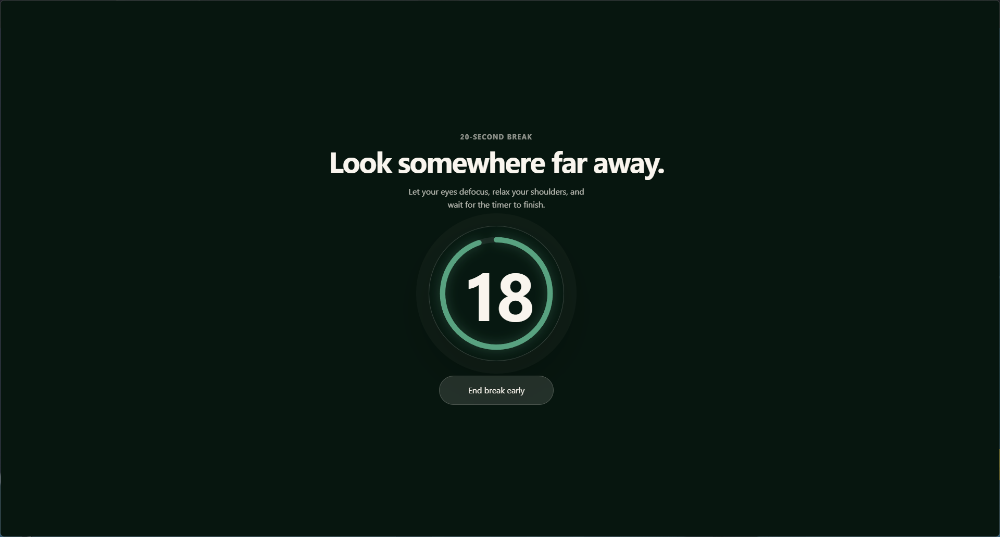
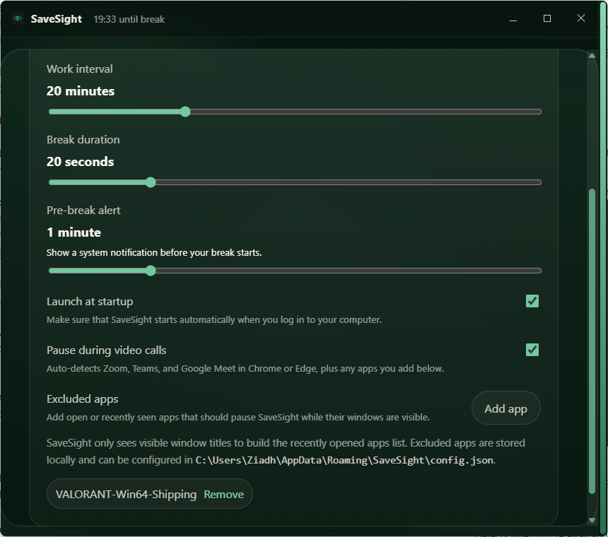

# SaveSight

SaveSight is a desktop app designed to help you protect your eyes and stay productive. It uses the proven **20-20-20 rule**. Every 20 minutes, you take a short break to reduce eye strain and fatigue.

Built natively for Windows, SaveSight runs quietly in the background and gently reminds you when it’s time to rest.

## What SaveSight Does

- **Smart work timer**  
  Automatically reminds you to take breaks at regular intervals.

- **Full-screen break reminders**  
   Displays a clear, distraction-free overlay across all your screens when it’s time to rest.
  
- **Works in the background**  
  Lives in your system tray (Windows) for easy access without interrupting your workflow.

- **Adapts to your activity**  
  Detects when you’re away and pauses the timer, so you’re not interrupted unnecessarily.

- **Understands meetings and calls**  
  Automatically pauses during video calls (Zoom, Microsoft Teams, Google Meet).

- **Customizable settings**  
   Adjust work intervals, break duration, excluded apps, and behavior to match your routine.
  
- **Starts with your computer**  
  Optionally launches automatically so you never forget to use it.

## Platform Experience

### Windows

- Runs from the system tray for quick access
- Minimizes instead of closing so it’s always available
- Starts silently in the background (optional)

## Why Use SaveSight?

Extended screen time can lead to eye strain, headaches, and reduced focus. SaveSight helps you build healthier habits without thinking about it.

It’s simple, unobtrusive, and designed to fit seamlessly into your daily workflow.
